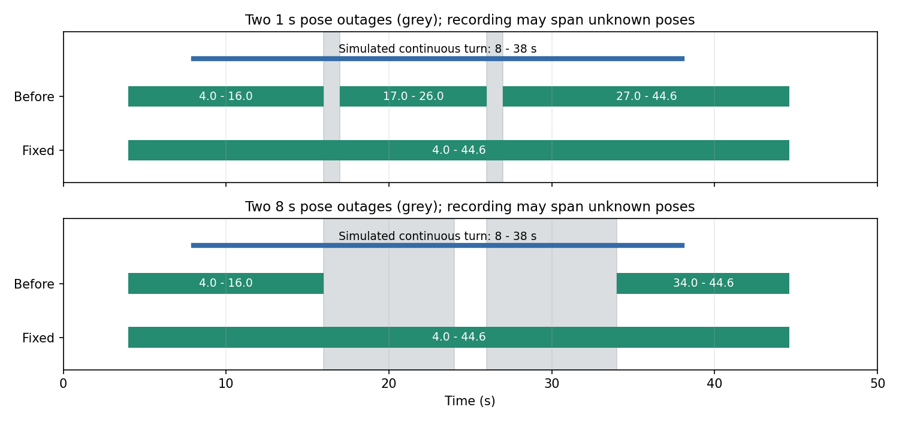

# 延迟 Gate 契约与转弯切碎：核查和最小修复

2026-09-22。对照版本为已推送的 `d9a7238`，源码快照为 [baseline_gate.py](baseline_gate.py)。用户确认核查并做最小修复；只修改仓库，未部署线上采集系统。

## 核查结论

同事指出的时序缺陷成立，且碎片化有独立原因。

1. `max(segment_start, min(decision, core - 4))` 确实不保证 `capture_start <= decision`。
   预看命中断流后的新连续段时，新段起点可以晚于 decision。
2. `end_collection` 对早于 active_start 的时间抛异常；装饰器直接转发，没有防御。
   catch-and-skip 调用方会跳过这些结束检查。实际线上控制器不在本仓库，不能由此断言
   其窗口一定永久卡住；单调 decision 追上起点后，本地 Gate 可继续工作。
3. 09-21 把 **所有 >0.5 s 普通空洞也改成录制硬停**。几何证据必须断开，但视频录制
   不必因此每次关闭。原测试甚至把这种切片当作预期，遗漏了场景完整性和延迟时间契约。

最小复现：缓存来自 10 Hz 轨迹，10 s 前直行、之后以 0.1 m/s 和 0.4 rad/m 转弯；删除
`(10,11)` 内 pose，缓存只提供到 `decision+6`。在 `decision=10.4` 时旧版返回
`start=(True,11.0)`，随后 `end(cache,10.4)` 抛 `ValueError`。
把空洞扩大为 2–8 s，各自取 `decision=新段首点-0.6`，均复现。数值有浮点舍入。

同事“新段首点就是现在”的说法不是每次调用的精确描述：本例最新可用 pose 已到
16.4 s，新段首点为 11.0 s。默认未来锚点探测仅 1 s，普通启动时越过 decision 的幅度
通常受它限制；即使只晚 0.6 s，契约也已经破坏，并不需要晚完整 6 s。

## 最小修复

- 当证据所属连续段起点仍晚于 decision，跳过该启动候选并等待后续决策，保持
  `action_start <= decision`。不把 capture 强行钳入缺失 pose 区间。
- 装饰器对 early end 立即返回 `(False, ts)`，不解析缓存、不推进扫描状态、不清空活动窗。
  Turn/Straight 的具体 end 及 Turn 的 early EOF 同样无操作。
- 普通时间 gap 不再单独硬停止录制；0.5 s 几何分段阈值不变，不跨洞滤波、插值或累计转角。
  洞内状态未知，不能算作持续直行或停车；恢复后重新取得连续证据。
- 位置变化 >2 m、yaw 变化 >45° 的跨洞端点仍保守截断。较长空洞中的正常运动也可能越界，
  这里只能说连续性无法确认，不能认定发生了定位跳变。3 s 稳定停车、45 s Tmax、EOF 保留。
- 接入文档改用与 pose 同域的单调媒体进度减 6 s。原 `pose_cache[-1]-6` 在没有新 pose 时
  停表，会连带停止 Tmax 的推进。应保留已有历史缓存并持续调度，不将断流变成空缓存。

没有改变 8° 常规转弯、4° 短慢弯、局部摆动排除、前置 4 s 和直行恢复后 4 s 等参数。
录制媒体可含定位未知的上下文，但训练监督仍受现有 pose 有效性与断段规则约束。

## 6 s 延迟与 1–8 s 空洞回放

[回放脚本](gap_replay.py) 以实际到达时钟逐步提供 pose，保留 60 s 缓存、0.2 s 检查节拍；
分别使用媒体时间与最后 pose 时间作为 decision 时钟，测试 0 和 0.11 s 两种调度相位。
场景包括无洞、1–8 s 单洞、1–8 s 双洞，共 17×2×2=68 组。结尾排空未判定的真实时间段
并 EOF 收尾；不插值补造 pose。旧版异常被记录后继续，模拟同事所述 catch-and-skip。

| 检查 | 09-21 旧版 | 修复后 |
| --- | ---: | ---: |
| 完整保持已知转弯、单窗且 ≤45 s、无异常/未来起点 | 4/68（仅无洞） | 68/68 |
| 起点晚于 decision | 10 次 | 0 |
| early end 异常 | 40 次 | 0 |
| 两个 1 s 洞，媒体时钟，相位 0 | 3 个保存窗 | 1 个保存窗 |

具体同一持续转弯为 `[8,38] s`；两个 1 s 洞位于 `(16,17)`、`(26,27)`。
旧版保存 `[4,16]`、`[17,26]`、`[27,44.6]`，修复后保存 `[4,44.6]`，长度 40.6 s。
这是同一合成真值场景的对照，不是把缺失 pose 本身推断为转弯。



逐次启停和异常见 [旧版回放](baseline_gap_replay.json)、[修复后回放](fixed_gap_replay.json)。
无洞对照仍一致；超过位置/yaw 截断阈值、停车或 Tmax 的片段仍可能被合理切开。

## 回归和已有数据

- 修复前原 60 项单测全部通过，确认是既有覆盖遗漏。修复后 **67/67** 通过。
  新增契约测试覆盖未来新段延后、early end/EOF 状态保留、Turn/Straight 普通洞、
  不跨洞累计短转角、恢复计时重置、不能跨洞证明停车、固定旧缓存到 Tmax 及恢复后重新确认。
  原“普通 gap 必须切片”测试改为显式验证新媒体上下文语义和 45 s 上限；几何分段未放松。
- 既有 **54/54** 已知几何流式回归通过，覆盖慢弯、短弯、S 弯、摆动、停车、长弯续段、EOF。
- 数据专家 subagent 独立复现原异常、审阅最小方案和代码 diff，并独立运行新增 **7/7** 测试；
  未发现新增阻断项。采用延后启动方案，保留原 `start<=decision` 契约。
- 复用同一 **159 个已采片段**，不拼接源片段，不重新处理。仍有 **84 个源段**可保存，
  拟保存窗 **87→84**。7 个源段窗口改变：0902-auto2 的 1/8/13 各由两窗合成一窗；
  0902-auto2 的 14/15、WIt 27、GCy 49 延长已有上下文。
- 既有 **32/32 明确转弯**保留，**69/69 明确近直线**不启动；旧盲评 **29/29** 一致。
  `0902-auto2` 19/20 仍排除。23 个模糊例仍保留 20 个，不能据此计算正确率。
- **640 个源文件**与上次审计及本次前后大小、mtime、SHA-256 一致。CCx_50 的元数据不一致
  继续报告并排除，未刷新导出、人工 map_name、frames.jsonl 或裁剪。

[真实数据逐段结果与源码 SHA-256](source_replay.json)、[几何回归](streaming_regression.json)、
[单测代码](../../test_data_collection_gate.py)。这些是开发回归结果，已保存数据不能衡量未采场景的线上总体 recall。
本次复用此前独立标签，没有重新随机抽样宣称新的盲测。

Python 编译与 `git diff --check` 通过；缺陷复现、核心验证和最终结果已按项目约定通过
`send-feishu-experiment` 成功同步飞书。

回放工具初次执行遇到跨模块 PoseSample 类型不兼容，改为转换为被测模块类型；新增直行测试
最初输入在 gap 前不足最短有效路线，调整合成直行速度为 0.2 m/s 后测试真实的已启动窗口。
这两项为验证输入修正，没有放宽生产判定。

## 复现

```bash
python3 -m unittest -q test_data_collection_gate.py
python3 reports/gate_delayed_gap_20260922/gap_replay.py --baseline
python3 reports/gate_delayed_gap_20260922/gap_replay.py
python3 reports/gate_delayed_gap_20260922/validate_streaming.py
python3 reports/gate_delayed_gap_20260922/replay_sources.py
python3 reports/gate_delayed_gap_20260922/plot_windows.py
```

采集端需要部署修复后的 Gate，并同步媒体时钟驱动、返回动作时间和 `should_save` 接入。
仓库测试不能替代实际录制器日志验收；本轮未直接部署或重导出线上数据。
