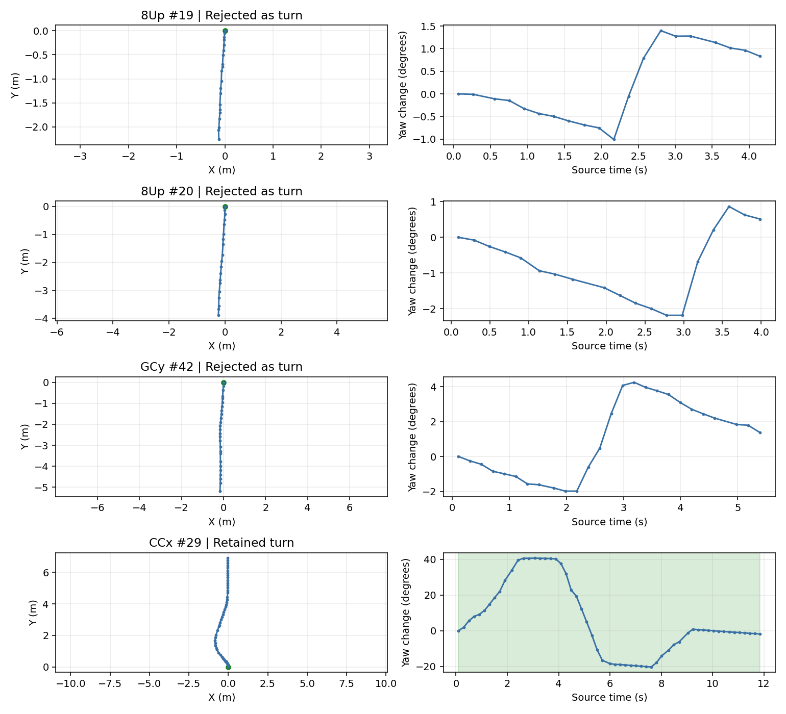

# 转弯 Gate：独立盲评与生产方法修正

日期：2026-09-21。先完成匿名轨迹标注和离线规则核对，再修改 `data_collection_gate.py`。没有下载、解包、重新处理或改写已有采集数据，没有部署远端录制器。

## 结论

- 新标注员盲看 **24 个随机样本 + 5 个重点对照**。随机组为 12 转弯 / 12 直线；对照组为 1 转弯 / 4 直线。最终生产 Gate 对这 29 个样本的保留判定全部符合盲评。
- 已有专家标签中的 **32 个明确转弯全部保留，69 个明确近直线全部不启动转弯采集**。`0902-auto2` 19/20 和 GCy 42 均排除。
- **60 项单测、54 次已知几何流式检查通过**；数据专家独立复核了 EOF 平滑泄漏、噪声驶离、持续宽弧、gap 续段四项修复，均通过。
- 保存起点默认向核心前回溯 4 s；恢复直行确认后再保留 4 s，通常包含约 5–6 s 驶离画面。停车、定位断点、45 s 上限和真实媒体末端优先。

这些是开发验证结果，**不是线上整体 precision/recall 的无偏估计**。标注来源是独立 subagent 的几何审阅，不是人工视频金标；源数据只有已经保存的片段，无法据此估计旧 Gate 从未采到的场景。

## 抽样与标注

候选全集为 4 个已下载任务中的 159 个有效片段、7,712 个 pose。使用 Python `random.Random(2026092103).sample(clips, 24)`，再加入不重复的 5 个重点对照，并打乱匿名编号。标注员仅获匿名等比例 XY、明确标尺的侧向厘米图、yaw 时序及原始数值；没有看算法输出、任务名、历史标签或映射表。

- [准备脚本](prepare_audit.py)、[匿名图](blind/)、[抽样映射](audit_key.json)、[原始盲标](blind_labels.json)。
- 29 例中 6 个浅弧边界为中置信度，其余为高置信度。所有已共享的明确历史标签一致；GCy 29 原为不确定，本次标注员认为是小幅纠偏直线，最终未保留。
- 标注员指出：例如约 5.2 m 行程、偏离首尾连线约 8 cm 的浅弧，仅凭轨迹无法知道道路曲率或操纵意图。此类边界按本次“小摆动算直线”的需求处理。
- GCy 42 被再次独立判为直线。离线短慢分支增加主要转角持续 ≥1.5 s 的约束后，29/29 吻合，之后才修改生产方法。[离线核对结果](audit_candidate_results.json)。抽样参与了设计选择，因此不能再称未使用的留出测试。

## 生产实现

1. 不再凭局部三点曲率直接确认。展开和平滑 yaw 后，用 2° 回转死区取方向波段；常规转弯要求 ≥8°、路径 ≥0.15 m，加同向 XY 路线方向变化 ≥3°。S 弯分方向检查，不用首尾净 yaw 抵消。
2. 保留短慢弯：≥4°、0.08–0.80 m，主要 5%–95% 转角形成时间 ≥1.5 s，同向一致性 ≥0.85，几何方向和拟合残差可信；必须等方向反转闭合或极值后至少 0.5 s 航向稳定。未结束的浅偏移前缀不是短弯。
3. 原始观测先限制到同一连续、最多 15 s 的窗口，再平滑和计算证据。6 s 调度延迟下允许有界历史复查。原地转向保留原来的 2 s / 8° / 10 cm 规则。
4. 核心起点与保存起点分开；前置停车上下文不会抢先结束真正转弯。退出采用整窗稳健直线拟合，容忍厘米级位置摆动，并用 4 s 持续 yaw 趋势保护缓慢宽弧。
5. 所有结束路径检查最终目标。证据被截掉时，在实际保存窗内重新确认；spin 的观测终点包含滤波所用的未来支持，禁止借用 EOF 后数据。
6. 45 s 上限包含上下文。跨切点的已确认核心可续段，默认重叠 4 s；不要求一秒钟的真实弯尾重新转够 8°。普通 pose gap 也在断点前封口，禁止续段跨缺失定位区间。
7. 新增幂等的 `finish_collection()` 关闭活动尾段。调用方须先排空最后 6 s 尚未检查的真实节点，再关闭尾段；方法不会替调用方扫描新事件。

方法继续仅依赖标准库；原启停二元返回值和 `CompletedCollection.should_save` 接口保留。新增诊断核心起止、yaw/XY 转向证据及分支原因。详细条件和调用契约见 [readme_gate.md](../../readme_gate.md)。

## 相同协议的历史回放

每个源片段独立回放，6 s 未来可用范围、60 s 滚动缓存、0.2 s 检查步长，结尾排空并按真实 pose 末端截断；不拼接片段、不虚构未来。对照版本保存在 [baseline_gate.py](baseline_gate.py)。首次脚本落盘遇到 NumPy bool 序列化失败，改为 Python float 输入后重新完整运行；算法和源数据未因此修改。

| 既有几何标签 | 样本数 | 修改前启动 / 保存 | 修改后启动 / 保存 |
| --- | ---: | ---: | ---: |
| 明确转弯 | 32 | 32 / 32 | **32 / 32** |
| 明确近直线 | 69 | 61 / 51 | **0 / 0** |
| 原有不确定 | 23 | 23 / 23 | 20 / 20 |

全部 159 段中，有可保存输出的源片段由 141 变为 84；新输出共 87 个拟保存窗，中位时长 11.64 s。没有把这些窗口应用到源数据。原有不确定组不能算作正确或错误来美化 precision。

原始保存片段已被旧系统截断，回放相位和可用上下文也会影响重放结果。例如 20 在本协议相位下旧 Gate 没有启动，但在前一轮完整片段直接诊断的指定锚点能复现高曲率触发；不能据本次窗口回放反推当时线上调度。最初原因与精确证据见 [19/20 诊断](../gate_0902_auto2_20260921/report.md)。

[逐段前后对照](baseline_replay.json)、[最终生产回放](current_replay.json)、[汇总与代码 SHA-256](summary.json)。



## 验证与发现后修复的问题

- 修改前 `python3 -m unittest -q test_data_collection_gate.py`：42/42 通过。
- 修改后同一命令：**60/60 通过**。保留原 42 个测试意图；精确旧启停时间显式设 `pre_context_s=0, post_context_s=0`，默认上下文另测。总转角取代每米曲率、未闭合弱候选不确认、停车之前不借后续转弯，是明确的语义变更，没有将旧误采作为必须保留的行为。
- `python3 reports/gate_method_revision_20260921/validate_streaming.py`：**54/54**。17 个历史低速/稀疏/停走/短弧场景，加 10 个新场景，每个检查 0 与 0.11 s 两种相位；验证最终保存窗口覆盖真实核心、没有额外无目标保存、每窗 ≤45 s。这是生产 API 的流式检查，和上轮离线原型的 27 个案例集合不完全相同。
- 独立专家复核过程中发现并修复：spin 的 EOF 过滤支持泄漏；2 cm 直线摆动导致拖到 Tmax；1°/s 宽弧尾部提前结束漏采；续段跨普通 pose gap。新增反例以及 0.6°/s 宽弧均已入单测，专家独立运行相应 4 项测试通过。
- Python 编译和 `git diff --check` 通过。没有运行与本次改动无关的下载、坐标转换或训练构建测试，也没有重新处理教师数据。

复现命令：

```bash
python3 -m unittest -q test_data_collection_gate.py
python3 -m py_compile data_collection_gate.py test_data_collection_gate.py
python3 reports/gate_method_revision_20260921/replay.py baseline
python3 reports/gate_method_revision_20260921/replay.py current
python3 reports/gate_method_revision_20260921/validate_streaming.py
python3 reports/gate_method_revision_20260921/summarize.py
```

## 开销与数据保护

[性能脚本](benchmark.py)使用相同 20 Hz 输入，3 次预热 + 20 次独立启动调用，并检查 15/60/120 s 缓存规模。60 s / 1,201 pose 时，直线负例启动检查中位数由 **8.71 ms 增至 20.41 ms**，95 分位 20.54 ms；弧线中位数由 8.06 ms 增至 9.65 ms。120 s 缓存直线中位数 28.60 ms。新增确认逻辑有成本，所测调用仍小于 5 Hz 的 200 ms 周期；共享主机存在调度噪声，这不是速度提升或真实录制器实时性的保证。

640 个源 JSON/JSONL/Manifest 的大小、mtime、SHA-256 前后一致；人工 `map_name`、裁剪结果及视频未写入。CCx_50 的 Meta 与视频 Manifest keep 窗不一致，仍跳过并记录，没有刷新现场。

已有裁剪文件缺失的前后画面无法补回。真实采集端需同步新模块、使用返回的保存起点和 `should_save`、提供足够媒体缓存、处理重叠续段并排空 EOF；仓库中没有远端录制控制器，本次没有部署。当前慢速原地旋转仍受原 2 s spin 和 3 s/3° 停车规则限制；不能由本次曲线召回结果推断所有慢 spin 均可采集。
