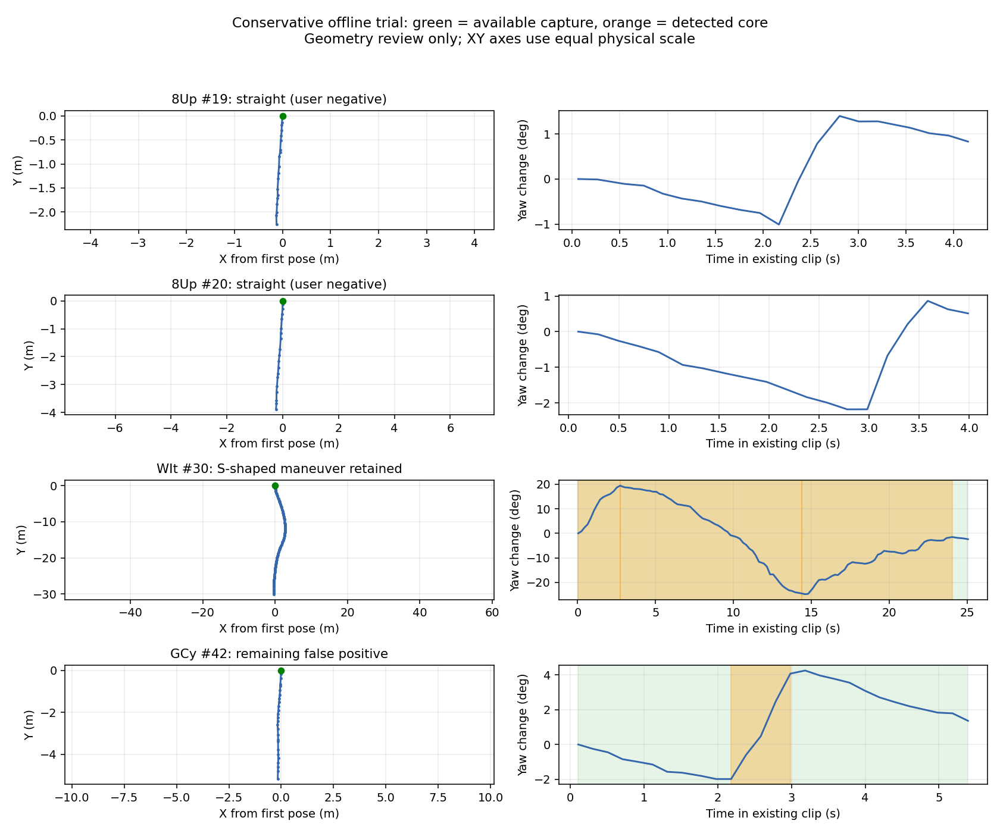
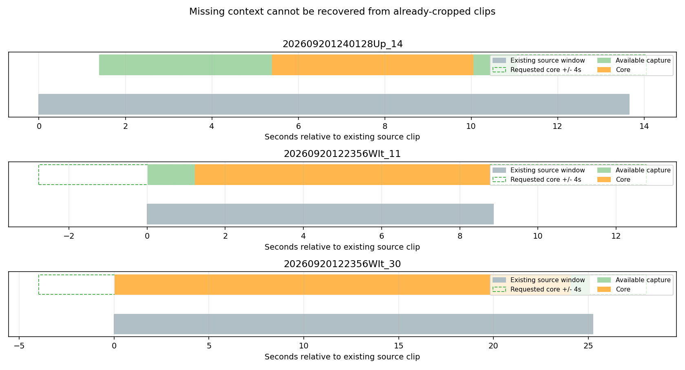

# 已采集数据上的转弯采集原型试验

日期：2026-09-21。

**结论：方向有效，但仍是离线原型。19/20 的误采被排除，独立几何审阅中的 32 个明确转弯
全部保留；69 个近直线片段中仍有 1 个被确认，另有 27 个进入待复核。弱绕行判据在第一次
跨任务验证中失败，因此保守版暂不自动确认只有弱绕行证据的片段。**

上述标签来自数据专家 subagent 在不知道对应算法结果时查看 XY/yaw 图的独立审阅，
不是人工逐帧视频金标；23 个边界片段另列，不计入确定正负例。这里不能据此宣称生产
precision/recall 达到某个比例。生产 Gate、采集数据、人工地图和裁剪均未修改。

## 数据、参考审阅与保护

- 复用 4 个本地任务，共 160 个目录；159 个片段通过本次读取一致性检查，合计 7,712 个
  有效 pose，源窗口时长合计约 1,638.5 s。每个源片段独立处理，不把未保存区间连接起来。
- `20260917174539CCx_50` 跳过：Meta keep 窗为
  `[1789639557.3681707,1789639562.3681707]`，视频 Manifest 为
  `[1789639557.3681707,1789639564.9568977]`。只记录不一致，不刷新或覆盖现场。
- 开始与完成时核对全部 640 个读取的源 JSON/JSONL/Manifest 的大小、mtime 和 SHA-256，
  全部一致。没有下载、解包、修改源视频、重跑教师、应用新筛选或覆盖已有标签。
- 8Up 33 段用于初次校准；WIt 37 段最初作为留出检查，发现问题后参与消融方案选择；
  GCy 54 段用于保守版冻结后的新检查。CCx 35 段只做无标签回放，不估计其正确率。
- 一个数据专家独立审阅上述前三批全部 124 个片段的原始等比例 XY/yaw 图，分类互斥完整：
  明确几何正例 32、近直线 69、不确定 23。只有 8Up 19/20 另有用户明确负例反馈。

## 实验版本与失败记录

初版实现去噪 yaw 的方向反转迟滞（2°）、稳健路线方向拟合、普通转向/绕行/短慢弯/原地
转向分支，以及独立的动作核心与前后 4 s 场景包装。相邻三点曲率不再直接决定是否采集。

1. **初版绕行横移 0.15 m**：8Up 6 个明确正例全部保留，但误确认近直线 16。
   其波段 yaw 约 6.1°、相对估计入射方向偏移 0.158 m。
2. **校准为 0.20 m 后冻结**：8Up 近直线确认数变为 0，5 个边界例保留；
   WIt 新任务中 7 个明确正例保留，却误确认 **14/15/18/19** 四个近直线片段。
   因而该版本的留出验证没有达到预期。把常规角阈值增至 10°/12°的敏感性对照，也不能
   从结构上解决弱绕行分支的误判。
3. **保守消融版**：只有弱绕行证据时进入复核档；普通转向、可信短慢弯、原地转向仍可确认。
   在 WIt 上的改善属于看过结果后的同批回溯，不能重新称为完全独立的留出成功。
4. 17 个历史几何反例回放发现首尾 XY 方向差被 `atan2` 折回后，超过 180° 的真弯被判成
   相反方向；补充实际路线方向的展开计数。随后冻结保守版，再检查 GCy 的独立几何标签。

弱绕行误判的原因不是门槛单纯偏小：入射方向只差 2°，走 10 m 就可产生约 0.35 m 的
表观侧移。当前原型的角度累积上限为 15 s，但几何仍取整个波段，也会放大长路径偏差。
因此没有继续把 0.20 m 调高来凑结果。初版代码快照、配置和失败输出均保留。

## 保守版结果

### 对全部本地片段的输出

| 任务 | 有效源片段 | 当前 Gate 在保存窗口内回放：有保留窗口 | 原型确认 | 待复核 | 直行 |
| --- | ---: | ---: | ---: | ---: | ---: |
| 202609201240128Up（0902-auto2） | 33 | 31 | 11 | 9 | 13 |
| 20260920122356WIt | 37 | 36 | 11 | 9 | 17 |
| 20260918200506GCy | 54 | 53 | 31 | 12 | 11 |
| 20260917174539CCx | 35 | 35 | 32 | 2 | 1 |
| 合计 | **159** | **155** | **85** | **32** | **42** |

“确认”表示原型检测到动作且拟保存窗口满 4 s，不代表重生成了视频/教师数据。
当前 Gate 列使用原始默认 6 s 延迟、60 s 缓存、0.2 s 检查，并显式处理源窗口 EOF，
只用于局部回放对照。它缺少线上完整历史/未来，因此不等于当时采集系统启停复现。
当前 Gate 原始 `owner` 标注为 151 turn / 8 straight，不能把 owner 当运动真值。

### 与独立几何审阅对照

| 数据角色 | 明确正例被确认 | 近直线被误确认 | 近直线待复核 | 近直线判直行 | 不确定例去向 |
| --- | ---: | ---: | ---: | ---: | --- |
| 8Up 校准 | **6/6** | **0/22** | 9 | 13 | 5 确认 |
| WIt 消融后复核 | **7/7** | **0/25** | 8 | 17 | 4 确认、1 待复核 |
| GCy 冻结后新检查 | **19/19** | **1/22** | 10 | 11 | 11 确认、2 待复核 |

- 用户指出的 **8Up 19/20 都判直行**。
- 8Up 18、WIt 30、GCy 37/39/52 等正反转动路线均保留，没有因首尾净 yaw 小而漏掉。
- 23 个边界例共 **20 确认、3 待复核、0 直接判直行**；待复核为 WIt 9、GCy 29/43。
  这些不算正确或错误确认，需要视频/场景标签进一步判断。
- 69 个近直线例中，68 个未进确认档，其中 27 个仍需复核。不能把它们都说成已经明确拒绝，
  也不能把复核档当成功保留来抬高正式样本召回。

### 剩余误采：GCy 42

该片段的短波段持续 **0.803 s**、yaw 变化 **5.773°**、路径 **0.681 m**，
路线拟合方向差 **4.634°**，相对估计入射线最大偏移 **2.80 cm**。
它被 `short_slow_turn` 分支确认，但独立图审认为属于近直线小修正。
说明目前弱分支虽然保住低速短弧，也会接收短促修正，“短慢弯”这个分支名本身并没有
保证动作缓慢。这里保留为新检查中的失败，不继续使用此批标签调参后宣称留出通过。



## 前后各 4 秒的效果与限制

保守版提出 **88 个拟保存窗口**（85 个源片段中部分含多个事件），窗口时长中位数约
**11.58 s**。这是基于现有资料选择的窗口，不是已经生成的新采集结果，也不能由此推断
将来上线后的片段时长分布。

**88 个窗口均至少有一侧达不到 4 s**：81 个前置不足、86 个后置不足。
原因包括已有源窗口边界、pose gap/跳变和 3 s 停车硬停止。原型没有填造、外推或跨缺口
拼接位姿/视频，也没有重新下载更多数据。

因此本轮验证了“哪些动作适合扩展、希望扩到哪里”，但已有裁剪片段不能展示完整的
新增上下文。前后 4 s 需要今后在录制端用真实媒体缓存保留；仅修改导出或把开始时间前移
不能恢复已缺失的画面。现有 60 s pose 缓存不代表已有同样长度的视频缓存。



## 已知几何回归

保守版 **27/27 离线检查通过**，其保存窗口完整覆盖这些已知真动作，纯负例无保存窗口。

- 复用 17 个历史几何场景：低速、停走、2 Hz 稀疏、有限短弧、短弧后停车及紧弯；
- 新增 10 例：纯直行、毫米静止漂移、厘米移动摆动、净角为零的 S 弯、前置长停车、
  110 s 长弯按 45 s 连续分段、快/慢原地转向、前进转倒退直行、位姿跳变。

这不是旧 Gate 的 42 项 API 单元测试，也不是同一线上时序的无损替换证明。新原型是
离线回溯提取核心，边界及部分几何使用整个已保存波段；6 s 延迟下的因果确认时机、
媒体缓存实际回溯、长任务状态管理和采样相位仍需未来的流式实现验证。
原地分支在此实验允许最多 15 s 累积角度，所以慢自转结果不能当作生产 2 s 判据的结果。

## 当前参数与下一步

原型参数完整保存于 `conservative_trial.json`：小反转死区 2°、普通转向 8°、弱分支 4°、
弱分支路径 0.08–0.8 m、方向一致度至少 0.85、最多 15 s 角度证据、前后各 4 s、
核心间隔最多 3 s 可合并、单窗口最多 45 s、连续分段重叠 2 s、最短保存 4 s。
弱绕行确认开关关闭，只送复核；其 0.20 m 参数留作初版对照，不在保守版直接触发确认。

推荐继续发展这个保守方向，但**本轮不替换生产 Gate**。后续重点不是再单调提高门槛：

1. 所有角度、几何、偏移、质量证据改在同一个有界观测区间计算，使用稳定的进入方向，
   并检查最佳直线是否已能解释路线，以及方向不确定性随距离放大的影响。
2. 针对短慢弯与短促微调建立独立场景标注，修正 GCy 42，同时保留 0.16 m/5.5° 的历史短弧。
   当前 `fit_error_m` 实为经过首点、沿拟合方向的横向偏离，不是严格的回归残差，需澄清并校准。
3. 对全部边界例和误采抽看视频；获取完整连续流，才能评价未保存区间的 recall。
4. 做因果流式回放与媒体缓存集成，区分动作边界和视频边界，不能让前置停车触发核心前的硬停止。

## 复现与产物

```bash
python3 reports/gate_offline_trial_20260921/data.py
python3 reports/gate_offline_trial_20260921/run_trial.py
python3 reports/gate_offline_trial_20260921/validate_candidate.py
python3 reports/gate_offline_trial_20260921/evaluate_conservative.py
python3 reports/gate_offline_trial_20260921/visualize_results.py
```

脚本仅读取本地源数据，写本报告目录，不调用下载/解包/教师流水线。重复执行会更新本报告
目录的派生结果；首次试验代码哈希记录在 JSON，初版实现另存 `candidate_initial.py`。

- [保守原型](candidate.py)、[初版快照](candidate_initial.py)
- [初版对照及失败结果](trial.json)、[保守版逐片段结果](conservative_trial.json)
- [独立几何审阅标签与角色](review_labels.json)
- [27 项回归证据](regression.json)、[回归日志](regression.log)
- [源保护快照](source_before.json)、[读取问题](source_issues.json)

定向回归阶段已通过 `send-feishu-experiment` 同步飞书，返回 `code=0`。
最终离线试验结论也已同步飞书，返回 `code=0`；收尾检查确认 640 个源文件、生产 Gate、
冻结原型和参考标签哈希一致，初版代码快照匹配，Python 语法及 diff 空白检查通过。
